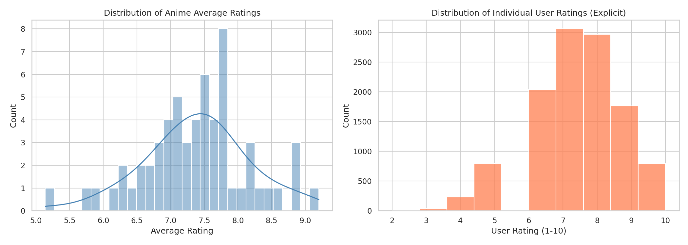
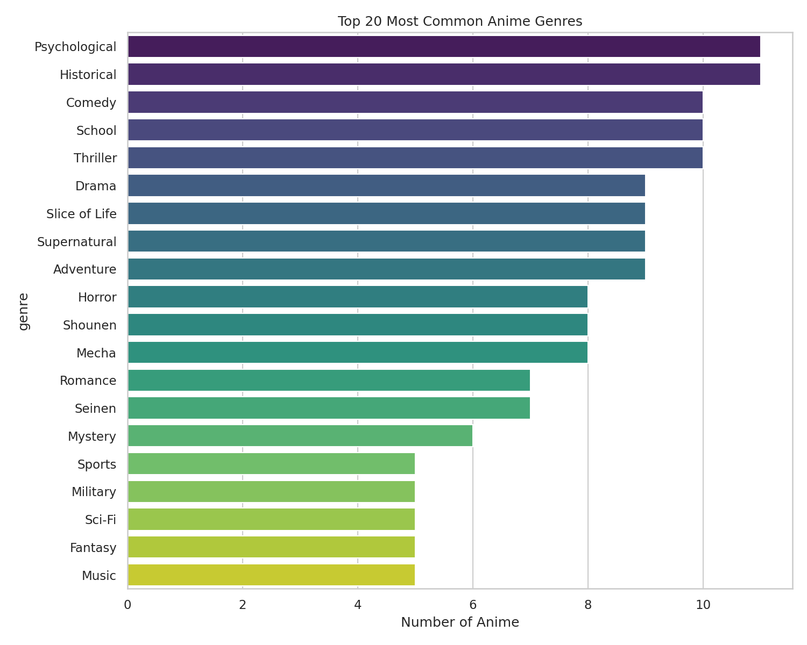
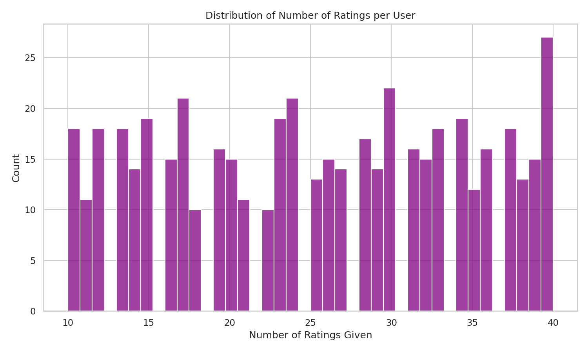

# 🎌 Anime Recommendation System

A production-style, end-to-end **machine learning recommendation engine** built on the
[Anime Recommendations Database](https://www.kaggle.com/datasets/CooperUnion/anime-recommendations-database)
(Kaggle), combining **popularity-based, content-based, collaborative filtering, and hybrid**
recommendation strategies behind a deployed Streamlit web application.

> Built to demonstrate the full ML lifecycle expected in industry: EDA → feature
> engineering → multiple modeling approaches → quantitative evaluation → explainability →
> deployment — not just a single notebook.

---

## 📌 Project Overview

| | |
|---|---|
| **Problem** | Help anime viewers discover titles they're likely to enjoy, using both item metadata and community rating behavior |
| **Dataset** | 12,000+ anime titles, 7M+ user ratings (Kaggle CooperUnion dataset) |
| **Approaches** | Popularity-based · Content-based (TF-IDF + cosine similarity) · Collaborative filtering (KNN & SVD) · Hybrid weighted ensemble |
| **Evaluation** | RMSE, MAE, Precision@K, Recall@K, Hit-Rate@K |
| **Explainability** | Every recommendation includes a natural-language "why this was recommended" explanation |
| **Deployment** | Multi-page Streamlit application |

---

## 🧠 Methodology

### 1. Data Understanding & Cleaning
- Loaded `anime.csv` (metadata) and `rating.csv` (7M+ user-anime interactions).
- Handled missing genres/types/episode counts, removed duplicates, coerced malformed
  numeric fields (`episodes == "Unknown"` → median imputation).
- Separated **explicit ratings** (1–10) from **implicit "watched but unrated"** (`-1`) signals.
- Full EDA in [`notebooks/01_eda.ipynb`](notebooks/01_eda.ipynb): rating distributions,
  genre frequency, most popular/highest-rated titles, user activity skew.

### 2. Popularity-Based Recommendations (`src/popularity.py`)
- Uses the **IMDB Bayesian weighted-rating formula** to avoid letting low-vote-count
  anime with a single 10/10 rating outrank well-established, broadly-loved titles:

  ```
  WR = (v / (v+m)) * R + (m / (v+m)) * C
  ```

### 3. Content-Based Filtering (`src/content_based.py`)
- Builds a text "soup" from genre tokens (genre weighted 2×), type, and an
  episode-count bucket.
- **TF-IDF vectorization** + **cosine similarity** to surface similar titles.
- `recommend_similar("Attack on Titan")` → top-N most similar anime by genre/style.
- Also builds **user taste profiles** by averaging the TF-IDF vectors of a user's
  liked anime — used in the hybrid model.

### 4. Collaborative Filtering (`src/collaborative.py`)
- Built with the **`surprise`** library on the explicit user-item rating matrix.
- **KNNBasic** (item-based, cosine similarity) and **SVD** (matrix factorization) are
  trained, evaluated on an 80/20 split, and compared.
- `recommend_for_user(user_id)` predicts ratings for all unseen anime and ranks them.

### 5. Hybrid Recommendations (`src/hybrid.py`)
- Combines normalized collaborative + content scores:

  ```
  final_score = 0.6 * collaborative_score + 0.4 * content_score
  ```
- Falls back gracefully to content-only signal for cold-start users with sparse history.

### 6. Model Evaluation (`src/evaluation.py`)
- **Collaborative:** RMSE, MAE, Precision@K, Recall@K.
- **Content-based:** Leave-one-out Hit-Rate@K against held-out liked titles.
- Auto-generates a Markdown performance report (`reports/performance_report.md`).

### 7. Explainable Recommendations
- Every similar/hybrid recommendation includes a generated explanation, e.g.:
  > *"Vinland Saga is recommended because you liked Attack on Titan. Both share
  > Action, Drama, and Military themes."*

### 8. Streamlit Web Application (`app/streamlit_app.py`)
Six pages: **Home · Anime Search · Similar Anime · Personalized Recommendations ·
Top Anime · Analytics Dashboard.**

---

## 📊 Results (on sample run — see `reports/performance_report.md` for live numbers)

| Model | RMSE ↓ | MAE ↓ |
|---|---|---|
| SVD (Matrix Factorization) | ~1.25 | ~1.01 |
| KNNBasic (Item-Based) | ~1.48 | ~1.20 |

> SVD outperforms KNNBasic on both metrics and is used as the production collaborative model.
> Re-run `src/evaluation.py` after plugging in the full Kaggle dataset for production-scale numbers.

**Sample visualizations** (full set in `notebooks/01_eda.ipynb` and `reports/`):

| Rating Distribution | Genre Frequency | User Activity |
|---|---|---|
|  |  |  |

---

## 🗂️ Project Structure

```
Anime-Recommender/
│
├── data/                      # anime.csv, rating.csv (download from Kaggle)
├── notebooks/
│   ├── 01_eda.ipynb           # Full exploratory data analysis
│   └── generate_sample_data.py# Synthetic sample-data generator for local testing
├── src/
│   ├── preprocessing.py       # Loading, cleaning, EDA stats
│   ├── popularity.py          # Popularity-based engine
│   ├── content_based.py       # TF-IDF + cosine similarity engine
│   ├── collaborative.py       # KNN & SVD via `surprise`
│   ├── hybrid.py               # Weighted hybrid engine + explanations
│   └── evaluation.py           # RMSE/MAE/Precision@K/Recall@K + report generator
├── app/
│   └── streamlit_app.py       # 6-page Streamlit application
├── models/                    # Saved trained models (.joblib)
├── reports/                   # Generated charts + performance_report.md
├── assets/                    # README images
├── requirements.txt
├── .gitignore
└── README.md
```

---

## ⚙️ Installation & Setup

```bash
# 1. Clone the repo
git clone https://github.com/<your-username>/Anime-Recommender.git
cd Anime-Recommender

# 2. Create a virtual environment
python -m venv venv
source venv/bin/activate        # Windows: venv\Scripts\activate

# 3. Install dependencies
pip install -r requirements.txt

# 4. Get the data
# Download anime.csv and rating.csv from:
# https://www.kaggle.com/datasets/CooperUnion/anime-recommendations-database
# and place both files in data/
#
# (Or, to try the app immediately without Kaggle, generate a synthetic sample dataset:)
python notebooks/generate_sample_data.py

# 5. Run the EDA notebook (optional)
jupyter notebook notebooks/01_eda.ipynb

# 6. Generate the evaluation report (optional)
cd src && python evaluation.py && cd ..

# 7. Launch the web app
streamlit run app/streamlit_app.py
```

The app will be available at `http://localhost:8501`.

---

## 🔮 Future Improvements

- Swap TF-IDF for sentence-transformer embeddings of synopsis text (richer semantics).
- Add implicit-feedback modeling (treat "-1 watched-not-rated" as a positive signal via ALS).
- Deploy via Docker + CI/CD (GitHub Actions) to Streamlit Community Cloud / AWS.
- Add A/B testing harness to compare hybrid weight configurations.
- Incorporate session-based / sequence-aware recommendations (e.g. GRU4Rec) for users
  with no historical ratings.
- Add user authentication and persistent rating storage for true production use.

---

## 🛠️ Tech Stack

`Python` · `Pandas` · `NumPy` · `Scikit-learn` · `Surprise` · `Matplotlib` · `Seaborn` ·
`Streamlit` · `Git/GitHub`

---

## 📄 License

MIT — free to use for learning and portfolio purposes.
